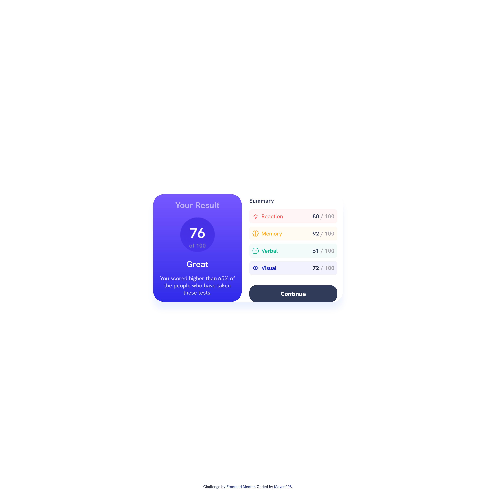

# Frontend Mentor - Results Summary Component Solution

This is my solution to the [Results Summary Component challenge on Frontend Mentor](https://www.frontendmentor.io/challenges/results-summary-component-CE_K6s0maV). This project allowed me to practice my frontend skills with HTML, CSS, and responsive design.

## Table of Contents

- [Overview](#overview)
  - [The Challenge](#the-challenge)
  - [Screenshot](#screenshot)
  - [Links](#links)
- [My Process](#my-process)
  - [Built With](#built-with)
  - [What I Learned](#what-i-learned)
  - [Continued Development](#continued-development)
  - [Useful Resources](#useful-resources)
- [Author](#author)
- [Acknowledgments](#acknowledgments)

## Overview

### The Challenge

Users should be able to:

- View the optimal layout for the interface depending on their device's screen size.
- See hover and focus states for all interactive elements on the page.
- **Bonus**: Use local JSON data to dynamically populate the content.

### Screenshot



### Links

- [Solution URL](https://your-solution-url.com)
- [Live Site URL](https://mayen007.github.io/Results-Summary-Component/)

## My Process

### Built With

- Semantic HTML5 markup
- CSS custom properties
- Flexbox
- Mobile-first workflow

### What I Learned

Through this project, I practiced using **CSS custom properties** for theme consistency and **Flexbox** for responsive layouts. Additionally, I applied **CSS gradients** and **inset shadows** to create depth in the score display component.

Here’s a snippet showing the CSS for the score display depth effect:

```css
.result-display {
  background: linear-gradient(to bottom, var(--light-slate-blue-bg), var(--light-royal-blue-bg));
  box-shadow: inset 0 10px 15px rgba(0, 0, 0, 0.25);
}
```
### Continued Development

I plan to continue focusing on:

- Enhancing responsive design techniques for complex layouts.
- Experimenting with CSS animations and transitions to improve UI/UX.
- Furthering my JavaScript skills to dynamically populate content from JSON data.

### Useful Resources

- [CSS Tricks - Inset Shadows](https://css-tricks.com/almanac/properties/b/box-shadow/#inset-shadows) - This helped me understand how to create inset shadows for depth.
- [Frontend Mentor Slack Community](https://www.frontendmentor.io/slack) - The community feedback helped me refine my solution, especially in CSS styling.

### Author

- **Website** - [Github](https://github.com/Mayen007)
- **Frontend Mentor** - [Frontend Mentor](https://www.frontendmentor.io/profile/Mayen007)

### Acknowledgments

Thanks to the Frontend Mentor community for their feedback and insights, which helped improve this project.